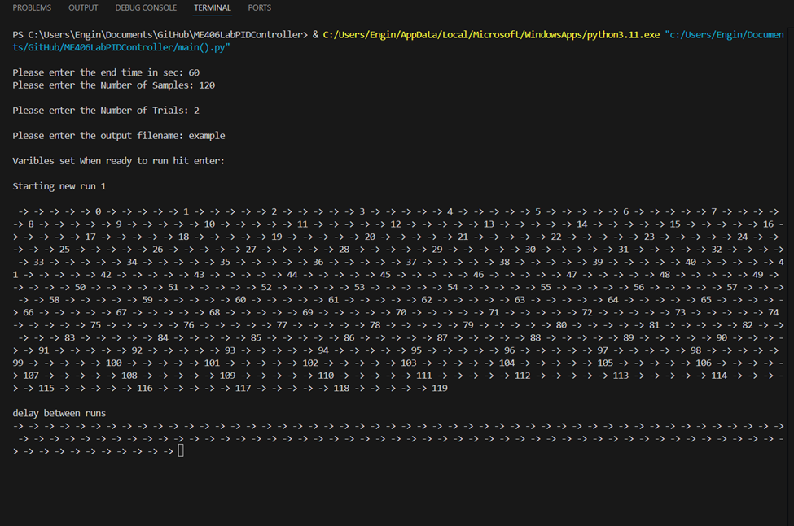
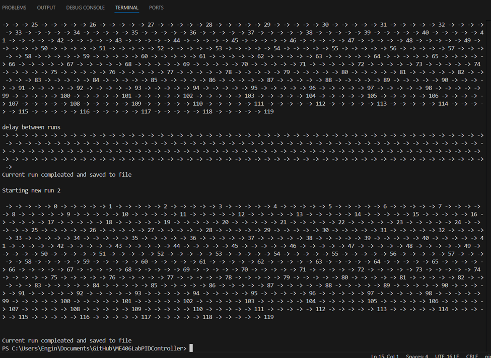

# ME406LabPIDController
ME 406 PID lab serial communication

This guide is for Windows 10 and 11 if you have another operating system you will need to make special changes to the installation and setup.

## How to Use the Python Script

1.	Once loaded into Visual Studio Code with the required libraries you should be ready to run after a few settings that need to be checked.

2.	First start by plugging in the serial interface to any USB port on your laptop does require a USB Type A port.

3.	Second hit “Windows key” and search for “device manager”.

4.	Scroll down the list a look for “Ports(COM & LPT)” click the drop down and look for the “USB Serial Port (COMx)” this should be the required serial device before moving on take note of the COM port number (in this example it is “COM5”) you will need to add that information to the Python Script.

5.	Now head back to Visual Studio Code and navigate to the “Main().py” file.

.py")

6.	Now on Line 16 it says `port = 'COM3'  # Update to your serial port` change the “COM3” to what you found in device manager so in my example the line will now read `port = 'COM5'  # Update to your serial port`

7.	To run hit the Triangle     in the top of the window to run. 

8.	You will then be asked a series of prompts in the terminal at the bottom of the screen the first prompt is ether the number of seconds you want to collect data for (see procedure for recommended time) when done hit enter to go to the next prompt.

9.	The next prompt is for the desired number of samples to be taken during to timeline (see procedure for recommended number of samples) when done hit enter to go to the next prompt.

10.	The next prompt is for the desired number of trials to be performed. The number of trials is the number of tank fills and empties (see procedure for recommended number of trials) when done hit enter to go to the next prompt.

11.	The next prompt is the Output File Name this can be whatever you want it to be and it will save to the same folder as the “Main().py” file.

12.	The Final prompt is to make sure you are ready to run the experiment when ready hit enter.

13.	Once you hit run you should get the output below and the number will slowly count up to the final number of samples.

14.	After the run there will be a delay after the run to let the tank drain. The script polls data from the controller until the tank is “Empty” then stats again appending to the existing python file.

15.	Now you just need to wait till the trials have been completed.

16.	Once the trials have been completed you can open the .txt file named in step 11 in Excel.

17.	That is how the python script runs and how the script will execute

## Importing the data to Excel

1.	Now you might be wondering about how to view the data well, fear not this is the section for you

2.	First open Excel and get to the home page like below

3.	Next hit “Open” then browse and navigate to the save folder

4.	In this folder you won’t see anything

5.	Next change the file type to “All files” in the bottom right corner

6.	Next select the run you want to open and click “open” in my case I am opening the “Example.txt”

7.	Next you will be prompted by the Text import Wizard. In the first window you want to select “Delimited” and “Next”

8.	Next Uncheck “Tab” and Check “Space” and hit “Finish”

9.	Congrats you have now imported the Text file to Excel

## Finding The COM port Manualy

1.	First hit “Windows key” and search for “device manager”.

2.	next scroll down the list a look for “Ports(COM & LPT)” click the drop down and look for the “USB Serial Port (COMx)” this should be the required serial device before moving on take note of the COM port number (in this example it is “COM5”) you will need to add that information to the Python Script.

